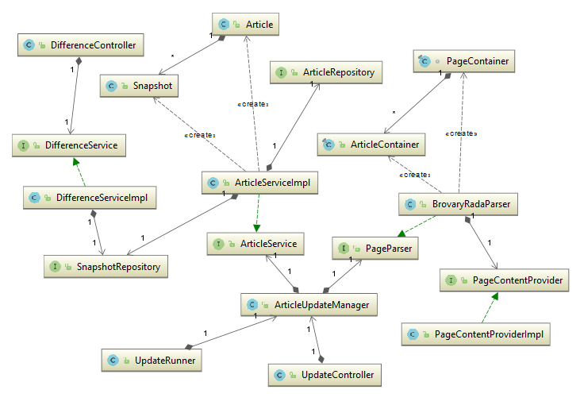

Додаток парсить документи що знаходяться за адресою: http://brovary-rada.gov.ua/documents

# Як запускати
 
## Docker

* Збілдити проект
* Збілдити docker image (Docker має працювати в режимі Linux контейнерів з властивістю:
"Expose deamon on tcp://localhost:2375 without TLS")
* Запустити docker контейнер

```cmd
mvn clean install
mvn docker:build
docker run -p 8080:8080 devchallenge/news-monitor
```

## Spring-boot plugin

```cmd
mvn spring-boot:run
```

## З IDE

Відкрити проект в IDE та запустити класс NewsMonitorApplication.java

# Функціонал

## Функціональні можливості/переваги

* Rest API реалізовано з використанням HATEOAS архітектури, тобто крім самих даних сервіс повертає метадані:
посилання на пов"язані ресурси, наступні сторінки, ендпойнти для пошуку, тощо. 
Завдяки цьому сервім є самодокументованим

* В ендпойнтах що повертають колекцію даних реалізована пейджинація

* Виклики до сервіса кешуються, та при повторному запиті дані будуть повернені з кеша без запиту до бази даних.
При оновленні даних в базі, кеши помічаються як застарілі.

* Робота з базою даних реалізована через JPA без прив"язки до конкретної бази даних.

* Додаток виконується на вбудованому сервері Tomcat, і може бути зібраний як виконуваний .jar архів, 
без необхідності використання окремого application server-а. 

## Ініціація оновлення даних

Є два варіанти для оновлення даних: по розкладу та шляхом виклику методу з API.

### По розкладу

Розклад оновлення конфігурується у файлі schedule-config.yml:

```yml
execTimes:
    - pagesToSync: 3
      cron: "0 0 * * * *"
    - pagesToSync: 10
      cron: "0 0 1/3 * * *"
    - pagesToSync: 30
      cron: "0 0 0 * * *"
    - pagesToSync: 50
      cron: "0 0 0 ? * SAT"
```

Це мапа яка ставить у відповідність cron вираз та кількість сторінок для синхронізації. 
Таким чином можна налаштувати, наприклад, наступну поведінку: 
Оновляти останні три сторінки кожну годину, 10 сторінок кожні три години, 30 сторінок щодня опівночі 
і 50 сторінок по суботам.
 
### Через виклик API
 
Оновлення можна викликати вручну відправивши GET запит на адресу: /manual/update?pagesToUpdate=10

## API

Для того, щоб почати користуватися сервісом, достатньо перейти на головну сторінку (http://localhost:8080/)
і далі користуючись посиланнями дослідити доступні ендпойнти.

```json
{
  "_links" : {
    "articles" : {
      "href" : "http://localhost:8080/articles{?page,size,sort}",
      "templated" : true
    },
    "snapshots" : {
      "href" : "http://localhost:8080/snapshots{?page,size,sort}",
      "templated" : true
    },
    "profile" : {
      "href" : "http://localhost:8080/profile"
    }
  }
}
```

article - це певна стаття (документ) з розпаршеного сайту, а snapshot - версія статті в деякий момент часу.

Деякі з доступних ендпойнтів:

* /articles - всі статті (з пейджинацією)
* /articles/1 - стаття з id 1
* /articles/1/snapshots - всі версії статті 1
* /articles/search/findByUrl - пошук статті по url
* /articles/search/findChanged - всі статті що змінювались (з пейджінацією)
* /articles/search/findDeleted - всі статті що були видалені (з пейджінацією)
* /snapshots/search/findLatest - останні версії всіх статей (з пейджинацією)
* /difference/leftId=1&rightId=2 - різниця між снепшотами з id 1 та 2 в html форматі.

## Спрощення прийняті в завданні

* Додаток виконується на embedded базі даних HSQLDB. 
В реальних умовах варто обрати standalone базу: (SqlServer, mySql, тощо). 
Додаток немає ніяких прив"язок до синтаксису HSQL, тому для переключення буде достатньо додати декілька властивостей
в файлі application.properties.

* Використовується дефолтний кеш (Що використовує ConcurrentHashMap). 
Можна обрати інший кеш провайдер (Hazelcast, GemFire, Guava cache, тощо)

* Відсутній контроль доступу до API (Авторизація, обмеження на кількість запитів)

# Реалізація

## Використані технології

* Spring Boot - дефолтна конфігурація, вбудований Tomcat сервер
* Spring MVC - для кастомних контролерів
* Spring Data JPA - для DAO рівня
* Spring Data Rest - для генерації Hypermedia REST сервісів з Spring Data репозиторіїв
* JSoup - бібліотека для парсингу html сторінок
* Apache commons, Guava - утилітні методи
* google-diff-match-patch - бібліотека для знаходження різниці між текстами

## Алгоритм

Для того, щоб забезпечити виявлення видалених записів використовується наступний алгоритм: 
При парсингу сторінок зберігається їх порядок і вони записуються в базу він старішої до новішої.
При наступному оновленні знаходиться найстаріший запис з розпаршених (нехай буде а) 
та загружаються всі записи з бази які новіші за а. Порівнюючи ці два набори даних можна виявити нові, 
змінені та видалені.

## Архітектура



(Див. файл uml.PNG)

* Article, Snapshot - класи доменної моделі.
* ArticleRepository, SnapshotRepository - DAO об"єкти, інкапсулюють роботу з базою даних.
* ArticleService - сервіс для роботи з об"єктами article, snapshot - прошарок між бізнес логікою та репозиторіями.
* Пакет difference: Знаходження різниці між двома версіями статей: веб контроллер DifferenceController 
та логіка в DifferenceService. 
* PageContentProvider інкапсулює логіку по отриманню даних з зовнішнього веб сервера.
* PageParser - абстракція для парсингу будь якого сайту. BrovaryRadaParser - імплементація для парсингу сайту
броварської ради. 
Для того щоб навчити додаток працювати з іншим сайтом, достатньо написати ще одну імлементацію PageParser.
* ArticleUpdateManager - логіка по знаходженню нових, змінених та видалених публікацій.
* UpdateController - контроллер для ручного запуску оновлення.
* UpdateRunner - запускає оновлення по розкладу згідно з налаштуваннями у файлі schedule-config.yml

## Тести

Додаток має тести двох рівнів: звичайні unit тести на моках, та integration тести.
 
На моках протестована логіка ArticleUpdateManager та UpdateRunner

Integration тести повністю піднімають додаток разом з embedded базою даних 
та перевіряють правильність роботи сервісів і репозиторіївю