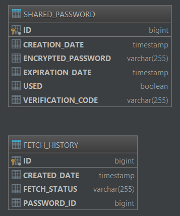

## Як стартувати

Через обмеження в 10MB немає можливості викласти зібраний додаток. Тому перед запуском треба його зібрати за допомогою
maven wrapper.

```cmd
mvnw package
docker-compose up
```

Або відкрити в IDE проект та запустити main class: SharePasswordService

Або 

```cmd
mvnw spring-boot:run
```

## Як запустити тести

```cmd
mvnw test
```

## Опис API

Після запуску swagger документація доступна за посиланням:
http://localhost:8080/swagger-ui.html

Доступні ендпойнти:
* POST /password - Розшарити пароль (Повертає посилання для його отримання)
* GET /password/{linkBody} - отримати пароль ({linkBody} - унікальний ідентифікатор паролю)
* GET /history/byId?passwordId={passwordId} - переглянути історію переходів для певного паролю
* GET /history/byStatus?status={status} - переглянути історію переходів для певного статусу
* GET /history/byDate?from={from}&to={to} - переглянути історію переходів здійснений в певний період часу

Приклади запитів:

```cmd
curl -X POST \
  http://localhost:8080/password \
  -H 'Cache-Control: no-cache' \
  -H 'Content-Type: application/json' \
  -d '{
	"passwords": ["mySuperSafePassword", "GH67K"],
	"expireInMinutes": 60
}'
```

```cmd
curl -X GET \
  http://localhost:8080/password/MS52YmFFT1h6NXhxLmowNTB4NDZWQk1Ea1F3cGw3UlpiMUE9PQ== \
  -H 'Cache-Control: no-cache' \
```

Результат для отримання пароля:

```json
{
    "passwords": [
        "mySuperSafePassword",
        "GH67K"
    ],
    "fetchStatus": "SUCCESS"
}
```

При повторному використанні:

```json
{
    "passwords": null,
    "fetchStatus": "ALREADY_USED"
}
```

Результат при отриманні історії:

```json
[
    {
        "id": 2,
        "passwordId": 1,
        "createdDate": "2018-10-14T08:59:05.62",
        "fetchStatus": "VERIFICATION_FAILED"
    },
    {
        "id": 3,
        "passwordId": 1,
        "createdDate": "2018-10-14T08:59:15.581",
        "fetchStatus": "SUCCESS"
    },
    {
        "id": 4,
        "passwordId": 1,
        "createdDate": "2018-10-14T08:59:17.758",
        "fetchStatus": "ALREADY_USED"
    },
    {
        "id": 5,
        "passwordId": 1,
        "createdDate": "2018-10-14T08:59:20.397",
        "fetchStatus": "ALREADY_USED"
    }
]
```

## Особливості реалізації

Даний сервіс створено на основі Spring Boot 2.0. 
Це дозволяє отримати багато корисного функціоналу з коробки з мінімальними налаштуваннями.
Додаток є доволі простим, тому використаний патерн Model View Controller цілком підходить.
Для роботи з базою даних використовується Spring Data, що робить код не залежним від конкретної реалізації бази даних.
Додаток може працювати на MySQL, Postgres, SQLServer, Oracle, тощо без додаткових змін.

Структура бази даних:



Паролі шифруються за алгоритмом AES та зберігаються в базі у зашифрованому вигляді. Секретний ключ необхідний для
розшифровки паролю кодується в посиланні, повертається користувачу ніде не зберігаючись. Таким чином тільки власник 
посилання може розшифрувати пароль.
 
В посиланні кодується verificationCode який зберігається в базі та звіряється при спробі отримання паролю. 
Це унеможливлює підбирання посилань та отримання зловмисниками навіть закодованого паролю.

Для паролю можна вказати час дії, є можливість зберегти одночасно декілька паролів.

В базі наявна історія створення паролів та переходів по посиланням, є можливість перегляду історії.

При переході за посиланням користувач отримує статус операції:
* SUCCESS - пароль успішно отримано
* ALREADY_USED - посилання вже було використано
* EXPIRED - у посилання сплив час дії
* WRONG_FORMAT, NOT_EXISTENT_ID, VERIFICATION_FAILED - не валідне посилання, 
дані помилки будуть виникати при підборі посилань

Присутні unit та integration тести.

## Наступні кроки

В даному завданні були зроблені певні спрощення. В реальному додатку необхідно змінити:

* Використати "серйозну" базу даних, замість h2.
* Додати контроль доступу до history ендпойнтів 