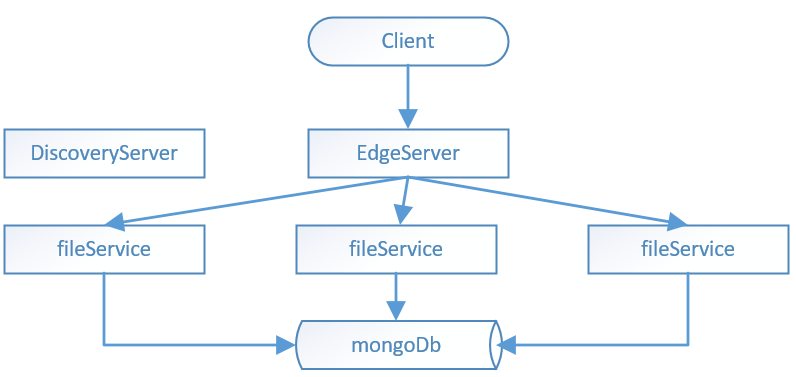

# Dump storage

## Архітектура


Додаток має мікросервісну архітектуру і складається з наступних елементів:

* DiscoveryServer - Сервіс що реєструє всі сервіси та допомагає їм знайти одне одного.
* AuthServer - Сервер OAuth2 авторизації. На ньому клієнт авторизується та отримує токен для доступу до API. 
 Інші сервіси використовують AuthServer для перевірки правильності токена та отримання інформації про користувача.
* EdgeServer - вхідна точка. Цей сервер працює як LoadBalancer - обирає на який FileService перенаправити запит 
(використовується середній час відповіді - таким чином обирається "найближчий сервер")
* FileService - сервіс, що виконує бізнес логіку нашого додатку - дозволяє загружати та скачувати файли, 
показує наявні файли та їх версії. В системі може працювати будь яка кількість екземплярів даного сервісу, 
що дозволяє легко масштабуватися. 
* MongoDb - використувується для зберігання даних. До кожного екземпляру FileService прив"язаний екземпляр сховища.
При чому сервери mongo пов"язані між собою в кластер. За рахунок цього на кожному FileService є доступ до всіх файлів
і кожен файл має резервні копії.

## Спрощення прийняті в даній реалізації



Під час реалізації завдання були прийняті деякі спрощення:

* Замість OAuth2 авторизації використовується спрощена перевірка наявності одного з тестових токенів
* Всі екземпляри FileService спілкуються з одним екземпляром MongoDb замість кластера.

Повноцінна реалізація цих пунктів не є надто важкою: OAuth легко реалізується в SpringBoot, а кластер MongoDB - 
питання конфігурації і не потребує змін в коді додатка.

## Q/A

**What parts will be custom and what – standard**
 
DiscoveryServer: Netflix Eureka, 
EdgeServer: Netflix Zuul.
Зберігання даних: MongoDb (GridFS).
FileService: Spring Boot + кастомна логіка.

**How you will split the functionality into microservices if needed**

Проект вже має мікросервісну архітектуру. При необхідності FileService можна розбити на менші частини - Окремо загрузка
та вигрузка файлів.

**How you will store and replicate information about service availability**

Цим займається DiscoveryServer (Netflix Eureka)

**How this will be tested**

SpringBoot Unit тести на FileService. Додатково можна написати End to End тести що будуть працювати на СI сервері,
 піднімати докер контейнери та перевіряти весь flow.
 
## Реалізація критеріїв
 
| Критерій  | Статус/Коментарії  |
|---|---|
| Basic Upload   | +  |
| Basic Download | +  |
| Upload/download with versions  | + |
| Upload/download with authentication | + |
| Support of big files  | + |
| Replicate on “r” servers  | + (Кластер Mongo робитиме це) | 
| Determination of nearest server for download  | + (Використовується стратегія WeightedResponseTimeRule. див. RibbonConfiguration) | 
| Failover of downloading files from other replicas  | + (EdgeServer буде направляти на робочі екземпляри FileService) | 
| Acknowledge of free space on other services  | + (Кластер Mongo сам розподілятиме дані) | 
| Same server for downloading as uploading  | + (Оскільки обирається найближчий сервер для загрузки/Вигрузки. Також є можливіть використовувати адресу конкретного FileService напряму.) |  

## Як запустити

1. Зібрати проект, створити docker контейнери 
(Команди запускаються з корневої папки проекту)

```cmd
mvn clean install
```

docker host за замовченням: tcp://localhost:2375. При використання Docker Toolbox він може відрізнятися. 
В цьому випадку треба встановити змінні оточення:

* DOCKER_TOOLBOX_INSTALL_PATH
* DOCKER_CERT_PATH
* DOCKER_HOST
* DOCKER_MACHINE_NAME
* DOCKER_TLS_VERIFY = 1

2. Запустити контейнери

```cmd
docker-compose up
```

Для того щоб переконатися, що система готова до роботи, можна зайти на сторінку Eureka: http://localhost:8761/


Повинен відображатися EDGE-SERVER та три екземпляри FILE-SERVICE.

## API

Корінь: http://localhost:8080, (хост може бути іншим, в залежності від налаштувань докера)

В кожному запиті має бути header "auth-token" з одним із тестових значень:
* fb44c65b-4e88-4629-ba7e-e1a17d2bc1e8
* c0490105-39bd-4bfe-9cba-41d2170418dc
* 28de669c-b8e2-42ec-a876-b1887a4714d1

1. GET /files - Список всіх файлів юзера (Для кожного файлу наявна інформація про його версії)
2. GET /files/versions/{fileName} - Версії конкретного файлу
3. GET /files/download/{fileId} - Завантижити конкретну версію файлу. (fileId треба взяти з результатів попередніх запитів)
4. GET /files/download/latest/{fileName} - Завантажити останню версію файлу.
5. POST /files - Загрузити файл.
 
Приклад відповіді на перший запит:
 
```json
[
    {
        "fileName": "r1_backend.pdf",
        "versions": [
            {
                "id": "5af32263c815010cc00a6e57",
                "length": 174681,
                "uploadDate": "2018-05-09T16:31:31.040+0000",
                "md5": "304287eab8a07b30e97a4ca25a588467",
                "contentType": "application/pdf"
            },
            {
                "id": "5af342cec815012040abcaa0",
                "length": 174681,
                "uploadDate": "2018-05-09T18:49:50.078+0000",
                "md5": "304287eab8a07b30e97a4ca25a588467",
                "contentType": "application/pdf"
            }
        ]
    },
    {
        "fileName": "r1_backend_clickky.pdf",
        "versions": [
            {
                "id": "5af350d6c81501157cd80310",
                "length": 199264,
                "uploadDate": "2018-05-09T19:49:42.430+0000",
                "md5": "91d1da71afbdcc2665bc828bc8bfb3b8",
                "contentType": "application/pdf"
            },
            {
                "id": "5af355c7c8150113885dab12",
                "length": 199264,
                "uploadDate": "2018-05-09T20:10:47.704+0000",
                "md5": "91d1da71afbdcc2665bc828bc8bfb3b8",
                "contentType": "application/pdf"
            },
            {
                "id": "5af361cec8150128ecd3379f",
                "length": 199264,
                "uploadDate": "2018-05-09T21:02:07.257+0000",
                "md5": "91d1da71afbdcc2665bc828bc8bfb3b8",
                "contentType": "application/pdf"
            }
        ]
    }]
```

Приклад запиту на загрузку файлу:

```cmd
curl -X POST
  http://localhost:8080/files
  -H 'auth-token: fb44c65b-4e88-4629-ba7e-e1a17d2bc1e8'
  -H 'content-type: multipart/form-data;
  -F 'file=@C:\files\fileToLoad.pdf'
```

Або через Postman:


Приклад запиту на скачування файлу:

```
curl -X GET
  http://localhost:8080/files/download/5af350d6c81501157cd80310
  -H 'auth-token: fb44c65b-4e88-4629-ba7e-e1a17d2bc1e8'
```

(В Postman зручно використовувати опцію "Send and download")

Щоб відправити напряму на fileService можна використовувати адреси:
* http://localhost:8090
* http://localhost:8091
* http://localhost:8092

(І прибрати частину /files з url)