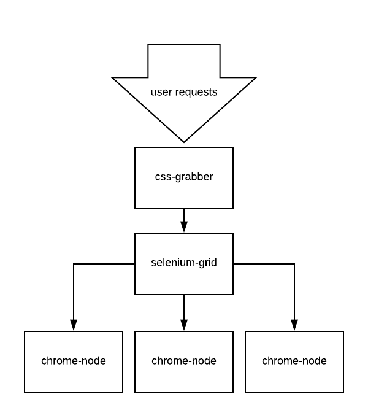
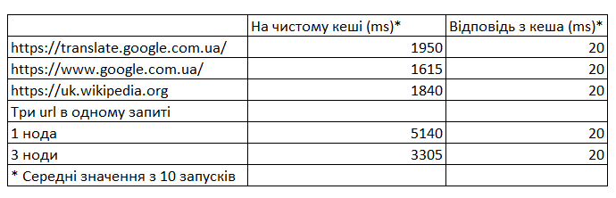

# CSS Grabber

## Архітектура



css-grabber - написано на основі Spring WebFlux - реактивний підхід дозволяє обробляти більше одночасних підлючень та легко виконувати
роботу паралельно. Додаток не запускає Chrome локально - замість цього він звертається до Selenium Grid. 
Selenium Grid автоматично обирає одну з доступних нод в кластері та виконує команди на ній (За допомогою RemoteWebDriver). 
Таким чином найвужче місце даного додатку - Google Chrome, легко масштабується - варто додати більше chrome нод. 

## Алгоритм

Для визначення використовуваних на сторінці CSS стилів використовується StyleSheet JavaScript API. 
За допомогою RemoteWebDriver на сторінці запускається скрипт який збирає всі підключені стилі а потім від-фільтровує ті що не використовуються -
перевіривши чи є на даній сторінці елементи з вказаним CSS селектором. Таким чином з браузера не повертається зайва інформація.
Після цього зібрані стилі зливаються в один та мініфікуються - це більш "важка" операція яку раціональніше виконати на стороні додатку.

## Як запустити

```cmd
docker-compose up
```

Щоб збільшити кількість chrome нод:

```cmd
docker-compose scale chrome=3
```

В папці target вже знаходиться збілджений проект, файл css-grabber-1.0.0.jar

При необхідності проект можна перезібрати:

```cmd
mvn clean package
```

При відсутності встановленого мавена можна використовувати mvnw на Linux та mvnw.cmd на Windows

```cmd
mvnw clean package
```

Щоб запустити тести без перезбирання проекту:

```cmd
mvn test
```

## API

* POST "/styles" - приймає список url адрес у форматі json. Повертає JSON - url на мініфікований css.
* POST "/cache/invalidate" - інвалідує весь кеш.
* POST "/cache/invalidate/url" - приймає URL в тілі метода - інвалідує запис в кеші для даного url.

Приклади:

```cmd
curl -X POST
  http://localhost:8080/styles
  -H 'Content-Type: application/json'  
  -d '["https://translate.google.com.ua/", "https://www.google.com.ua/", "https://uk.wikipedia.org"]'
    
curl -X POST
  http://localhost:8080/cache/invalidate
  
curl -X POST
  http://localhost:8080/cache/invalidate/url  
  -d https://www.google.com.ua/    
```

## Швидкість роботи

Результати вимірювань відносні - залежать від потужності комп"ютера, якості інтернету та швидкості загрузки сторінок.
Але вони показують декілька моментів: Вплив кешування, паралельної обробки та масштабування.



Спостереження:
* Результати з кеша повертаютья майже миттєво.
* При обробці декількох url на одній ноді час трохи менший ніж сума трьох окремих, але все впирається в Chrome.
* При обробці на декількох нодах видно приріст в швидкості - завдяки паралельному виконанню.

## Виконання критеріїв

### Паралельна обробка декількох запитів
Реалізовано за допомогою Reactor project. Див. CssGrabberController.executeAsync. 
Переконатися що запити виконуються паралельно, можна запустивши тест CssGrabberIntegrationTest.getStyles та дослідивши логи:

```
2018-06-01 16:49:54.259  INFO 18000 --- [ctor-http-nio-2] i.d.cssgrabber.web.CssGrabberController  : Getting styles for urls: [google.com, youtube.com]
2018-06-01 16:49:54.275  INFO 18000 --- [      elastic-3] i.d.c.css.CssGrabberServiceImpl          : Launching Chrome for url: youtube.com
2018-06-01 16:49:54.275  INFO 18000 --- [      elastic-2] i.d.c.css.CssGrabberServiceImpl          : Launching Chrome for url: google.com
2018-06-01 16:49:54.281  INFO 18000 --- [      elastic-3] i.d.c.css.CssGrabberServiceImpl          : Finishing Grabbing styles for url: youtube.com
2018-06-01 16:49:54.281  INFO 18000 --- [      elastic-2] i.d.c.css.CssGrabberServiceImpl          : Finishing Grabbing styles for url: google.com
```

Як бачимо, обробка для youtube.com та google.com йде в різних потоках: elastic-3 та elastic-2

### Кешування згенерованого CSS для URL 
Реалізовано за допомогою Spring Caching Framework. Результати CssGrabberService.getCss кешуються автоматично, інвалідація кеша здійснюється
через CacheService (Існують окремі ендпойнти для інвалідації всього кеша, та для певної url. Див. CssGrabberController), 
інвалідація по часу - через CacheInvalidationComponent. Час інвалідації вказується у файлі налаштувань application.yaml (По замовчуванню 10 хвилин).

Виконавши два раза запит на один і той же url бачимо що на другий раз запит виконується миттєво. 
Також під часу другого запиту в логи не пишеться "Launching Chrome for url..."

Якщо запросити наприклад три url серед яких один вже є в кеші, то Chrome запускатиметься тільки для інших двох.

### Стійкість до memory leak
Досягається шляхом гарантованого закриття ресурсів (WebDriver в SeleniumChromeClient.getStyles)

### Наявність тестів
Наявні два рівня тестів: 
Unit tests - тестується один класс, всі залежності підміняються моками (CacheInvalidationComponentTest, CacheServiceImplTest,...)
Integration tests - (CssGrabberIntegrationTest) - піднімаєтся повністю веб додаток, за допомогою TestRestTemplate посилаються запити на контроллер,
відрпрацьовує вся логіка (Замоканий тільки найнижчий рівень - RemoteWebDriver)

### Обробка помилок
Кожен url обробляється незалежно, помилка при його обробці не впливає на решту запиту. 
У відповіді будуть зібрані стилі для успішних адрес та повідомлення про помилку для неуспішних.