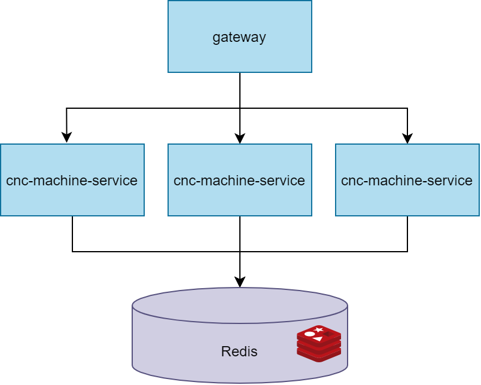

# CNC-MACHINE Service

## Як запустити

Результуючий jar файл займає більше 10mb, немає можливості відправити його разом з кодом, 
тому необхідно збілдити його за допомогою gradle. Для цього на комп'ютері має бути встановлена JDK 11, 
і змінна оточення JAVA_HOME що вказує на папку з JDK. В терміналі виконайте команду:

```cmd
gradlew clean build
```

Дана операція запустить білд разом з виконанням тестів. Щоб запустити тести окремо:

```cmd
gradlew test
```
Або запустіть з IDE: SimpleBoxControllerIntTest.kt

Тепер щоб запустити додаток:

```cmd
docker-compose up
```

Додаток stateless, не використовує інших сервісів (тільки In memory embedded cache) тому може бути просто запущеним з IDE.
Для цього запустіть клас CncMachineApplication.kt

Після запуску сервісу можна посилати на нього запити:

```cmd
curl --location --request POST 'localhost:8080/api/simple_box' \
--header 'Content-Type: application/json' \
--data-raw '{
  "sheetSize": {
    "w": 800,
    "l": 600
  },
  "boxSize": {
    "w": 100,
    "h": 100,
    "d": 100
  }
}'
```

Приклади інших запитів разом з тестами ви можете імпортувати як Postman колекцію з файлу docs/Devch.postman_collection.json.
Або взяти приклади запитів з Integration тестів SimpleBoxControllerIntTest.kt

## Методологія

Додаток являє собою мікросервіс написаний на Kotlin на фреймворку Spring Boot. Kotlin дає можливість писати коротший 
та більш читабельний код, а Spring Boot дає з коробки багато необхідного функціоналу. Використовується кешування запитів, 
тобто запит з тими ж вхідними параметрами не буде обрахований заново а просто повернутий з кеша. Враховуючи специфіку задачі,
однакові запити будуть не рідким явищем (Багато де треба буде виготовляти однакові коробки типових розмірів з типових листів картону),
тому кешування дозволить підвищити швидкість обробки таких запитів. (Для спрощення я використав in memory cache, але в продакшені це може бути Redis).
Також, при деплої в cloud додаток може легко бути масштабованим для обробки більшої кількості паралельних запитів.




## Алгоритм

Для розміщення заготовок на листі була використана open source бібліотека Nest4j 
(https://github.com/grotius-cnc/nest4j) це портована на Java бібліотека SVGNest (https://svgnest.com/). 
Вона реалізує генетичний алгоритм bin packing-у, та може пакувати контури не прямокутної форми. 

Наш додаток валідує вхідні параметри створює Т-подібну розгортку, вираховує можливу кількість розміщених фігур (з запасом)
та запускає алгоритм розміщення для даної конфігурації. Після цього отримані розміщення переводить в команди для ЧПУ станка.

### Реалізовані оптимізації

* Використання Т подібної форми розгортки замість хреста дозволяє більш щільно пакувати.
* Перевіряються всі можливі комбінації h,w,d для розгортки коли ми знаємо що одна коробка точно поміститься. (Див. тест 'Place a single box, swap sides')
* Ми спеціально вираховуємо скільки фігур передавати на розміщення алгоритму (враховуючи площі листа, розгортки та loadFactor) - щоб пришвидчити роботму алгоритму.
* В залежості від можливої кількості фігур ми вираховуємо кількість ітерацій генетичного алгоритму. Завдяки цьому розміщення більшої кількості працює швидше, а меншої - більш точно.
* При генерації програми для ЧПУ ми враховуємо розрізи вздовж країв листа, прибираючи їх та оптимізуючи переміщення різака.
* Отримана розкладка кешується, та буде використана повторно при таких самих вхідних параметрах.

### Для оптимізації в майбутньому

* Використовувати не тільки T подібну форму розгортки, але й інші, комбінацію різних форм.
* При достатньо великому листі і малому розміру коробки генерувати розміщення тільки для частини листа (Наприклад 1/4) і застосовувати його на інші частини.
* Оптимізувати реалізацію алгоритму в nest4j (Додати паралелізацію, тощо)
* Додати ендпойнт для візуалізації розгорток (Кешування дозволить гарантувати, що сервіс завжди повертає ту саму розкладку для тих самих вхідних параметрів)


