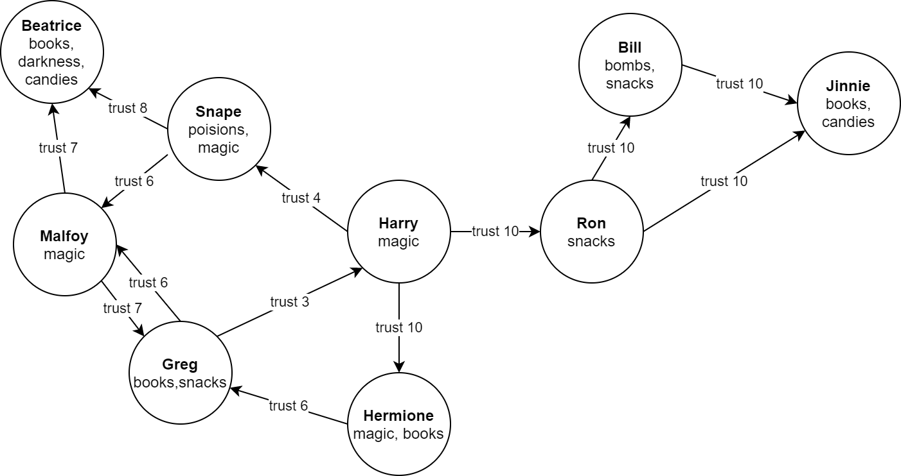

# Trust Network

## How to launch

To Start service, execute in project folder:

```shell
docker-compose up
```

API is available, as described in task on localhost:8080/api
(Basic /people endpoints, /messages and bonus task /path)

To run tests, execute in project folder:

```shell
./gradlew test
```

JDK 18 needs to be installed on machine, and running Docker (testcontainers are used)

## Service description

Neo4j is used as a database. Graph database fits well for our case as our data model is basically a graph. 
It allows to perform searches in the database and fetch only required results. It is also ensures optimal performance, 
as we use existent algorithms instead of writing our own.

All used technologies:

* Java 18
* Spring Boot, Spring Web, Spring Data, Spring Test
* Neo4j
* Junit, RestAssured, Testcontainers

As we use Graph database, task of searching paths in graph is solved by Cypher query. For example, query for bonus task:

```Cypher
MATCH p=shortestPath((:Person{id: $from})-[:trust*]->(l:Person)) WHERE
                        all(r IN relationships(p) WHERE r.trustLevel >= $minTrustLevel) AND
                        all(requiredTopic IN $requiredTopics WHERE requiredTopic IN l.topics)
                        RETURN p ORDER BY length(p) LIMIT 1
```

## Performance

Application uses resources efficiently, as all work is done on the database side, minimum data is fetched to the app side.
Application is stateless, so it can be easily scaled. As well as Neo4j: https://neo4j.com/product/neo4j-graph-database/scalability/

## Testing

All usecases for /people and /message /path endpoints is covered by integration tests. Real neo4j database is used for that (Started in docker with a help of testcontainers)

See: MessageControllerIntTest, PeopleControllerIntTest

Graph used in MessageControllerIntTest


 